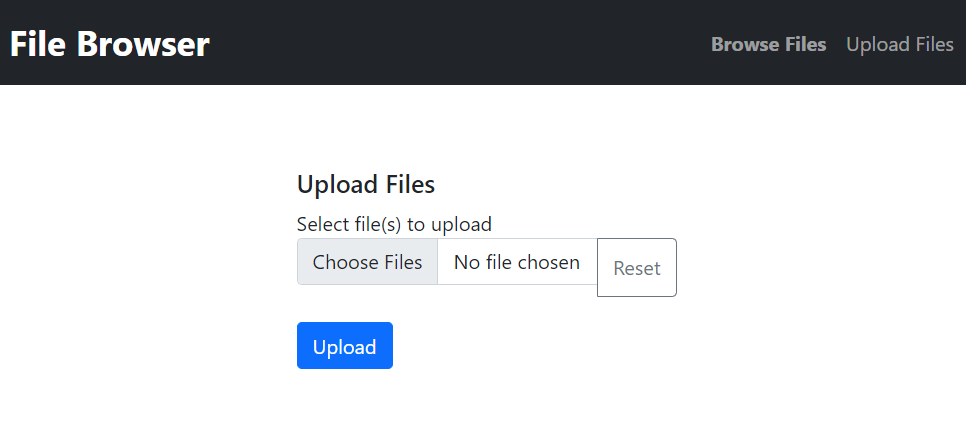

# pcap browser

This is an experimental project to view pcaps in the browser with tshark from a server.
This is a starter project, and works for small pcap files.

## Start

1. Install pip dependencies

```sh
pip install -r requirements.txt

```

2. start the app

```sh
python app.py
```


## Images

file upload view




## Dependencies

The following dependencies are required for this tool installation.

### Install tshark

Install tshark package, instructions for all platforms here: https://tshark.dev/setup/install/

Here are the steps for Ubuntu:

https://pkgs.org/search/?q=tshark

```sh
sudo apt install tshark
```

verify the tshark location

```sh
$ whereis tshark
tshark: /usr/bin/tshark /usr/share/man/man1/tshark.1.gz

$ tshark -v
TShark (Wireshark) 3.6.2 (Git v3.6.2 packaged as 3.6.2-2)
```

